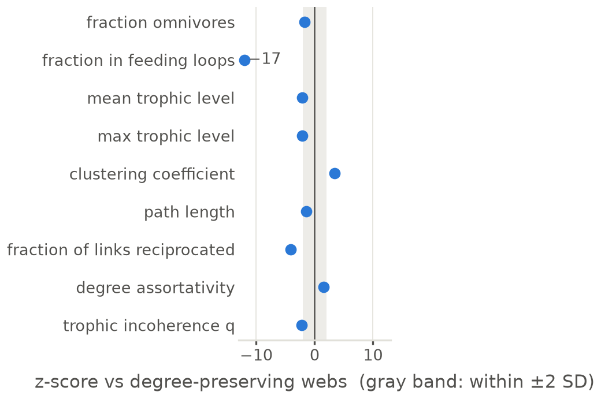
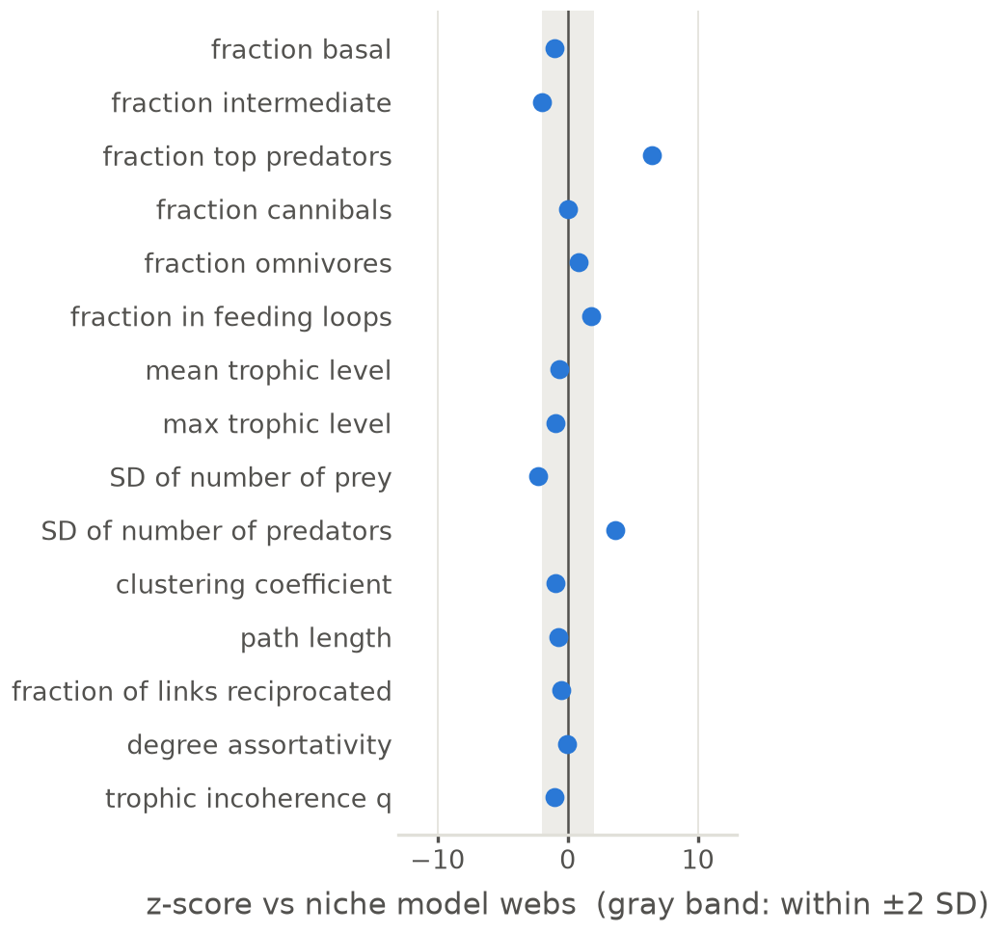

# Structure against null models

Drawn by [`code/network_structure.py`](../../code/network_structure.py). The numbers behind these figures are in [`notes/03_structure.md`](../../notes/03_structure.md).

| Figure | What it shows |
|---|---|
| [`structure_vs_degree_preserving`](structure_vs_degree_preserving.png) · [pdf](structure_vs_degree_preserving.pdf) | z-scores against degree-preserving rewired webs. |
| [`structure_vs_niche_model`](structure_vs_niche_model.png) · [pdf](structure_vs_niche_model.pdf) | z-scores against niche-model webs. |
| [`structure_vs_random`](structure_vs_random.png) · [pdf](structure_vs_random.pdf) | z-score of each whole-web measure against random (ER) webs; the gray band is ±2 SD. |

### structure_vs_degree_preserving

### structure_vs_niche_model

### structure_vs_random

